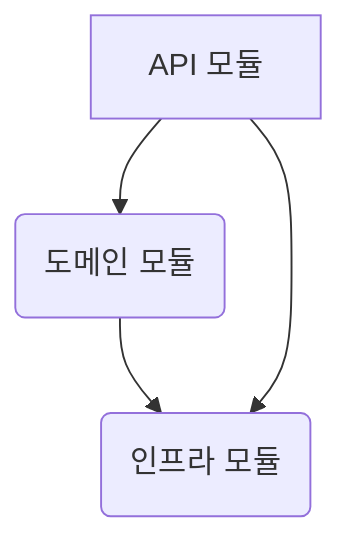
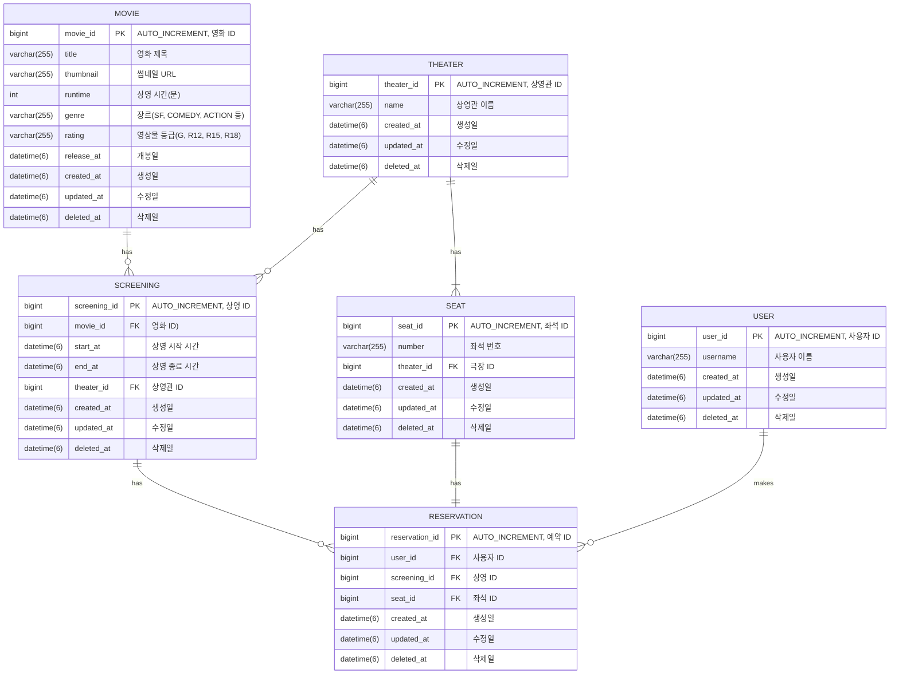

# Rrdis Proejct

## 영화 예매 시스템

### 1. 멀티 모듈

#### 1. API 모듈(module-module)

- 클라이언트와 직접 통신하는 Controller 계층 포함
- 요청을 받아 도메인 계층에 위임하고 응답을 반환

#### 2. 도메인 모듈(domain-module)

- 비즈니스 핵심 규칙을 구현하는 Domain 계층 포함
- 외부 시스템에 대한 의존성을 제거하여 확장성을 높임

#### 3. 인프라 모듈(infra-module)

- 외부 시스템과의 연결 담당하는 Repository 계층 포함
- 도메인 모듈에서 사용하는 구체적인 구현체를 제공

### 2. ERD

